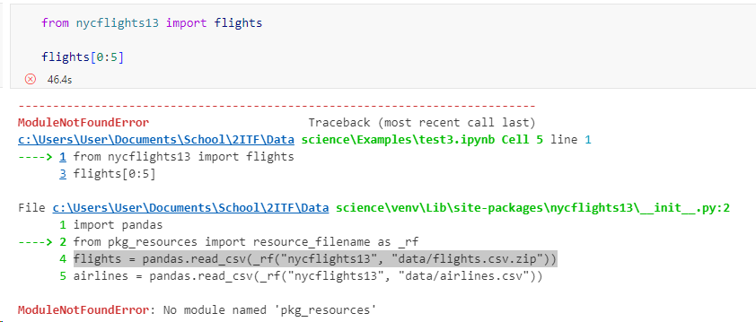
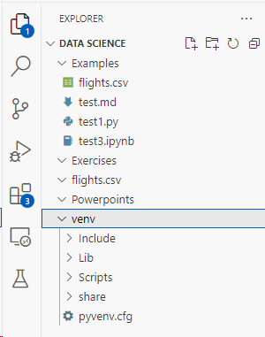
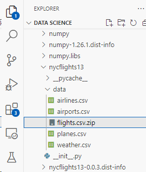
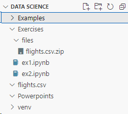

# Flights error

When using the flights dataset (exercise 5.1) you may encouter the following error:



This is because you are using Python 12, which seems to throw this error. We trust this will solve itself shortly, but in the mean time the following workaround works.

* Make sure the cell containing "!pip install nycflights13" ran succesfully.
* In your folders, locate your Virtual Environment.
    * Usually a folder called "venv" in your root.



* In this folder, navigate to "venv/Lib/nycflights13/data



* Copy the file called "flights.csv.zip" to the files folder of your exercises.



* Back in the notebook that threw the error, replace the cell containing

```
from nycflights13 import flights

flights[0:5]
```

By the following code:

```
import pandas as pd
flights = pd.read_csv("files/flights.csv.zip")
flights[0:5]
```

You can now continue working with the flights-dataset.